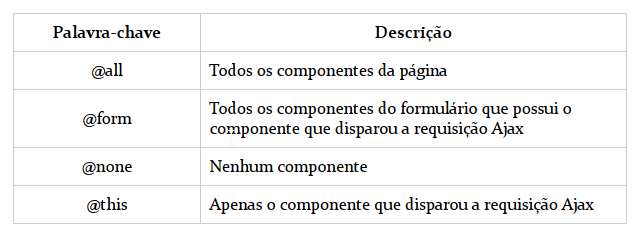

# Java EE 7 com JSF, PrimeFaces e CDI por Thiago Faria
\
Meus apontamentos feitos seguindo o livro com o titulo acima citado.
Neste projecto usei o Jakarta EE 9, preferi usar a última versão logo.\
## Feramentas Usadas

1. IntelliJ IDEA;
2. Jakarta EE 9;
3. Servidor Payara e Glassfish Full;
4. Banco de dados PostgreSQL;
5. Primefaces para a camada de visualização;
6. Gestão de dependencies com a implementação do próprio servidor.

## Notas
1. Imagem com os valores predefinidos possiveis para render e execute de um elemento ajax.
   1. \
*by **Edilson Alexandre Cuamba***
